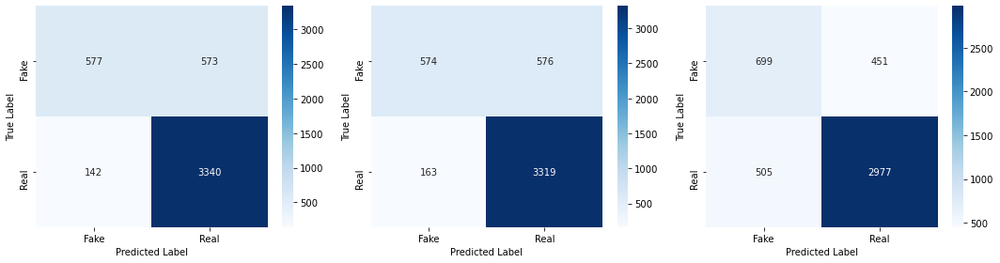
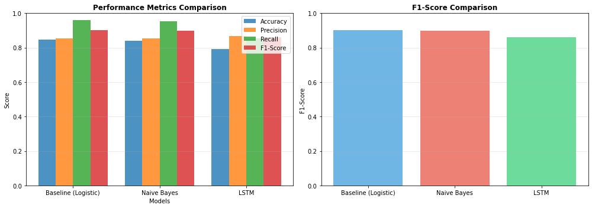

# Fake News Detection

An NLP project that classifies news headlines as **real** or **fake**. It compares two statistical models, **Logistic Regression** and **Naive Bayes**, with a deep learning **LSTM** model, trained on the **FakeNewsNet** dataset of about 23,000 headlines.

Midterm coursework for a Natural Language Processing course.

## Approach

1. **Data**: `data/FakeNewsNet.csv` has 23,196 headlines labelled real (17,441) or fake (5,755)
2. **Two preprocessing pipelines** built with NLTK:
   - **Statistical models:** lowercasing, tokenisation, stop-word removal and Porter stemming, then **TF-IDF** (5,000 features, unigrams and bigrams)
   - **LSTM:** lowercasing, tokenisation and keeping only alphabetic words, then a Keras `Tokenizer` and **padded sequences** (length 50, vocabulary of 10,000)
3. **Stratified 80/20 train/test split**: 18,527 / 4,632 headlines
4. **Models**
   - **Logistic Regression** (baseline)
   - **Multinomial Naive Bayes**
   - **LSTM**: Embedding (128) → LSTM (64, with dropout) → Dense (32) → Dropout → sigmoid, trained with early stopping and learning-rate reduction
5. **Evaluation**: accuracy, precision, recall, F1-score and confusion matrices

## Results

| Model | Accuracy | Precision | Recall | F1-Score |
|---|---|---|---|---|
| **Logistic Regression** (baseline) | **0.8456** | 0.8536 | **0.9592** | **0.9033** |
| Naive Bayes | 0.8405 | 0.8521 | 0.9532 | 0.8998 |
| LSTM | 0.7936 | **0.8684** | 0.8550 | 0.8616 |





Logistic Regression performed best overall. Naive Bayes was close behind and cheaper to train. The LSTM had the highest precision but the lowest accuracy on these short headlines. The notebook's conclusions section discusses the trade-offs.

## Running the notebook

### Quick start (one command)

**Step 1:** Run this command in the terminal first. It downloads the project from GitHub into a temporary folder, installs the required packages in a separate environment (so your main Python isn't changed), and starts Jupyter:

```bash
D=$(mktemp -d) && gh repo clone Alizea2/Fake-News-Detection "$D" && cd "$D" && python3 -m venv .venv && .venv/bin/pip install -q -r requirements.txt && .venv/bin/jupyter notebook Fake_News_Detection.ipynb
```

> TensorFlow is a large download (several hundred MB), so the first setup takes a few minutes.

**Step 2:** Jupyter usually opens in your browser by itself. If it doesn't, click the link that starts with **`http://localhost:8888/`** in the terminal output. Copy the whole link, including the `?token=...` part.

**Step 3:** Choose **Run → Run All Cells**. The LSTM training takes a few minutes on a laptop CPU.

When you're done, close the browser tab and press `Ctrl + C` in the terminal to stop Jupyter.

> This needs Python 3 and the [GitHub CLI](https://cli.github.com/) (`gh`) signed in to an account that can access this repository.

### Manual setup

From inside the project folder:

```bash
pip install -r requirements.txt
jupyter notebook Fake_News_Detection.ipynb
```

### Note on re-running

The notebook shows the outputs from the original submission. With current library versions:
- **Logistic Regression and Naive Bayes:** within about 0.1% of the table above, because newer NLTK versions tokenise a few words differently.
- **LSTM:** results vary from run to run, as neural-network training usually does.

## About this notebook

The original `.ipynb` file was lost, so this notebook was **rebuilt from the exported PDF** of the coursework. The code, text, outputs and figures are transcribed from that PDF. Re-running it reproduces the data processing exactly: the same 23,159 cleaned headlines, the same train/test split and the same feature shapes.

## Project Structure

| File / Folder | Purpose |
|---|---|
| `Fake_News_Detection.ipynb` | The full project: introduction, code, results and conclusions |
| `data/FakeNewsNet.csv` | The dataset |
| `confusion_matrices.png`, `model_comparison.png` | Result figures |
| `requirements.txt` | Python packages |

## Dataset

FakeNewsNet, via Kaggle: [algord/fake-news](https://www.kaggle.com/datasets/algord/fake-news) (Golovin, 2022). Columns: `title`, `news_url`, `source_domain`, `tweet_num` and `real` (1 = real, 0 = fake).

## Built With

- Python 3, [Jupyter](https://jupyter.org/)
- [NLTK](https://www.nltk.org/), [scikit-learn](https://scikit-learn.org/), [TensorFlow / Keras](https://www.tensorflow.org/)
- [pandas](https://pandas.pydata.org/), [NumPy](https://numpy.org/), [Matplotlib](https://matplotlib.org/), [seaborn](https://seaborn.pydata.org/)

## Author

[@Alizea2](https://github.com/Alizea2)
